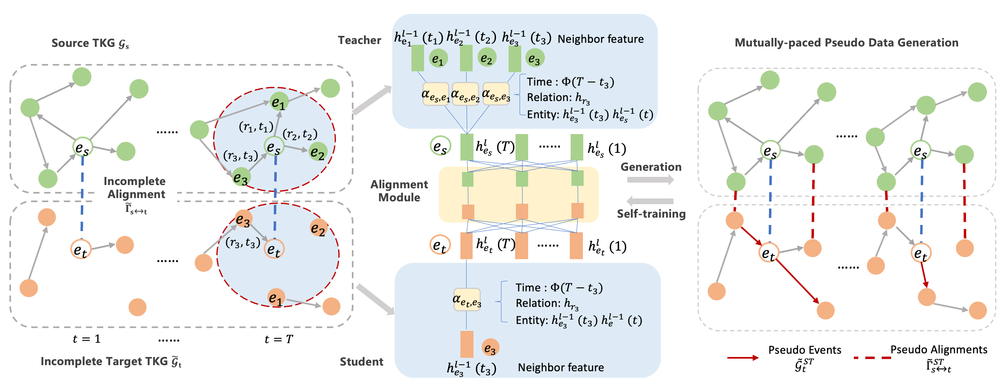

# Mutually-paced Knowledge Distillation for Cross-lingual Temporal Knowledge Graph Reasoning

A PyTorch implementation of "Mutually-paced Knowledge Distillation for Cross-lingual Temporal Knowledge Graph Reasoning" (TheWebConf 2023). [[paper to appear]()]

<font color = #FF000> ***The current repo is primarily for area chair review and is still under construction, please do not distribute!***</font>

Contact: Ruijie Wang (ruijiew2@illinois.edu)




## Abstract
This paper investigates cross-lingual temporal knowledge graph reasoning problem, which aims to facilitate reasoning on Temporal Knowledge Graphs (TKGs) in low-resource languages by transfering knowledge from TKGs in high-resource ones. The cross-lingual distillation ability across TKGs becomes increasingly crucial, in light of the unsatisfying performance of existing reasoning methods on those severely incomplete TKGs, especially in low-resource languages. However, it poses tremendous challenges in two aspects. First, the cross-lingual alignments, which serve as bridges for knowledge transfer, are usually too scarce to transfer sufficient knowledge between two TKGs. Second, temporal knowledge discrepancy of the aligned entities, especially when alignments are unreliable, can mislead the knowledge distillation process. We correspondingly propose a mutually-paced knowledge distillation model MP-KD, where a teacher network trained on a source TKG can guide the training of a student network on target TKGs with an alignment module. Concretely, to deal with the scarcity issue, MP-KD generates pseudo alignments between TKGs based on the temporal information extracted by our representation module. To maximize the efficacy of knowledge transfer and control the noise caused by the temporal knowledge discrepancy, we enhance MP-KD with a temporal cross-lingual attention mechanism to dynamically estimate the alignment strength. The two procedures are mutually paced along with model training. Extensive experiments on twelve cross-lingual TKG transfer tasks in the EventKG benchmark demonstrate the effectiveness of the proposed MP-KD method

## Data

### Option 1: Direct Download:

Please download data via [Google Drive](https://drive.google.com/drive/folders/1XUKcvfxjKEzgrK6LQikvIbxPX3HRmU1Y?usp=sharing).
### Optional 2: Build Your Own:
#### Step 1: 
Download EventKG dataset: [Temporal Events](https://zenodo.org/record/1205373/files/relations_entities_temporal.nq?download=1), [Entities Info](https://zenodo.org/record/1205373/files/entities.nq?download=1).

#### Step 2:
Run `data/Event_process.ipynb` step by step. For efficiency, cache mode can be truned on in each step in the jupyter script. (Please note that the parsing code may need modifying  according to different EventKG versions.)

## Model Usage (Under Construction)

```
python main.py [-h] [--use_cuda USE_CUDA] [--device DEVICE] [--seed SEED] [--data_dir DATA_DIR] [--data_name [DATA_NAME]] [--task [TASK]] [--method METHOD]
               [--load_old_data LOAD_OLD_DATA] [--neg_factor NEG_FACTOR] [--train_time TRAIN_TIME] [--test_time TEST_TIME] [--load_model LOAD_MODEL]
               [--score_function SCORE_FUNCTION] [--num_neighbors NUM_NEIGHBORS] [--attn_mode ATTN_MODE] [--use_time USE_TIME] [--agg_method AGG_METHOD]
               [--num_layers NUM_LAYERS] [--drop_out DROP_OUT] [--n_head N_HEAD] [--emb_dim EMB_DIM] [--node_dim NODE_DIM] [--edge_dim EDGE_DIM]
               [--time_dim TIME_DIM] [--use_pretrain USE_PRETRAIN] [--residual RESIDUAL] [--grad_norm GRAD_NORM] [--lr LR] [--n_epoch N_EPOCH] [--margin MARGIN]
               [--test_epoch TEST_EPOCH] [--train_batch TRAIN_BATCH] [--align_train_batch ALIGN_TRAIN_BATCH] [--test_batch TEST_BATCH] [--l2_weight L2_WEIGHT]
```

To check the result, go to log folder for following log files:

* `log.txt`: training/testing log;
* `model.pt`: student model;
* `source_model`.pt: teacher model;
* `all_model.pt`: whole framework;
* `result.json`: hyperparameter + evaluation result in json format;

### Train model on source and target separately:
```
cd model_separate/
python main.py --data wiki --task {source}-{target}
```
### Train model on target on full graphs:
```
cd model_train_int/
python main.py --data wiki --task {source}-{target}
```

### Train model on source and target in static setting:
```
cd model_static/
python main.py --data wiki --task {source}-{target}
```

### Train model on source and target in joint setting:
```
cd model_joint/
python main.py --data wiki --task {source}-{target}
```

### Train model on source and target in temporal setting:
```
cd model_temporal/
python main.py --data wiki --task {source}-{target}
```

